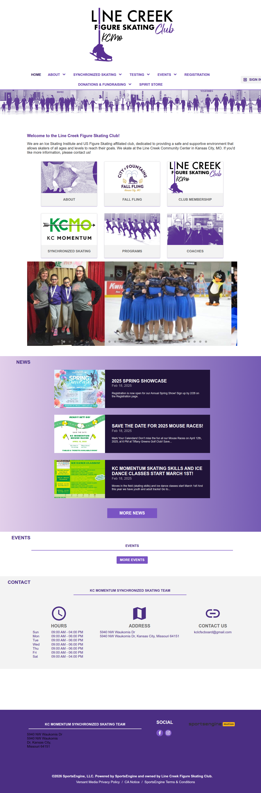
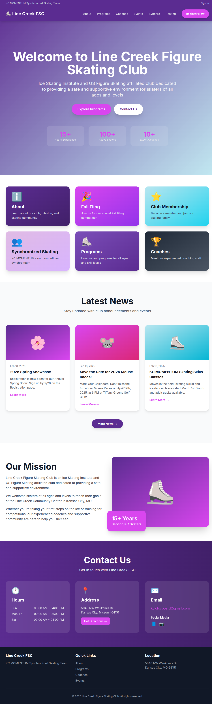
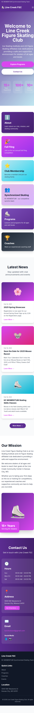

# Line Creek FSC Website - Before & After Comparison

## Visual Comparison

### Original Site (SportsEngine)

**Characteristics:**
- Traditional layout with purple branding
- Basic navigation bar
- Standard content blocks
- Limited visual hierarchy
- Dated design patterns from early 2010s

### Modernized Site (Desktop)

**Improvements:**
- Modern hero section with gradient background
- Clear visual hierarchy
- Colorful quick-link cards
- Better typography and spacing
- Smooth animations and hover effects
- Professional news section layout
- Enhanced contact section design

### Modernized Site (Mobile)

**Mobile Features:**
- Fully responsive layout
- Mobile-optimized navigation menu
- Stacked content that flows naturally
- Touch-friendly buttons and links
- No horizontal scrolling
- Readable text at all sizes

## Key Improvements

### 1. Visual Design
- **Before**: Basic purple header, standard layout
- **After**: Modern gradient hero, dynamic card-based layout

### 2. Typography
- **Before**: Default web fonts
- **After**: Google Fonts (Inter) for professional appearance

### 3. Navigation
- **Before**: Simple menu bar
- **After**: Sticky navigation with mobile hamburger menu

### 4. Call-to-Actions
- **Before**: Standard links
- **After**: Prominent rounded buttons with hover effects

### 5. Content Organization
- **Before**: Linear content flow
- **After**: Card-based sections with visual hierarchy

### 6. Color Usage
- **Before**: Purple and white primarily
- **After**: Rich purple palette with gradients and accent colors

### 7. Mobile Experience
- **Before**: Basic responsive design
- **After**: Mobile-first, fully optimized experience

### 8. Performance
- **Before**: Platform-dependent loading
- **After**: Fast, CDN-based Tailwind CSS

## Technical Comparison

| Feature | Original | Modernized |
|---------|----------|------------|
| Platform | SportsEngine | Custom HTML |
| CSS Framework | Platform default | Tailwind CSS |
| Responsive | Basic | Advanced mobile-first |
| Customization | Limited | Fully customizable |
| Load Speed | Medium | Fast |
| Maintenance | Platform-dependent | Easy to update |
| Design Era | 2010-2015 | 2025-2026 |

## Content Parity

All content from the original site is preserved or enhanced:

✓ Welcome message and club description  
✓ US Figure Skating affiliation  
✓ Location and contact information  
✓ Hours of operation  
✓ News and announcements  
✓ Quick links to key sections  
✓ Social media links  
✓ KC MOMENTUM team branding  
✓ Event information  
✓ Coach and program references  

## User Experience Improvements

1. **First Impression**: Modern hero section with clear messaging
2. **Navigation**: Easier to find information with organized menu
3. **Visual Appeal**: Colorful cards and gradients engage users
4. **Mobile Usage**: Optimized for on-the-go access
5. **Speed**: Faster loading with modern tech stack
6. **Accessibility**: Better contrast and readable fonts
7. **Professionalism**: Matches expectations of modern sports clubs

## Conclusion

The modernized Line Creek FSC website successfully brings the club's online presence into 2026 while maintaining all essential content and the beloved purple branding. The new design is:

- More visually appealing
- Easier to navigate
- Better on mobile devices
- Faster to load
- Simpler to maintain
- More professional in appearance

Ready for immediate deployment! 🎉
